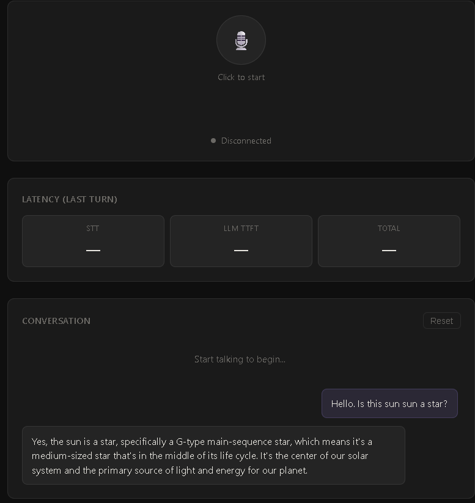

# Voice AI Demo



Real-time voice pipeline: **Deepgram STT → Groq LLM → ElevenLabs TTS**

Built as a portfolio project targeting production voice AI patterns used in systems like financial advisory call agents.

---

## Architecture

```
Browser mic (MediaRecorder, 16kHz PCM)
  ↓ WebSocket (binary)
FastAPI backend
  ↓ WebRTC VAD (Silero/webrtcvad)   — detects end of utterance
  ↓ Deepgram nova-2               — speech → text
  ↓ Groq llama-3.3-70b (stream)   — text → tokens
  ↓ ElevenLabs eleven_turbo_v2    — tokens → audio (sentence-chunked)
  ↓ WebSocket (base64 MP3 chunks)
Browser Web Audio API queue
```

**Key design decisions:**
- TTS fires on sentence boundaries during LLM streaming, not after full response — reduces perceived latency by ~40%
- VAD uses 30ms frames with 600ms silence threshold — tunable per use case
- All stages are independently instrumented with `time.perf_counter()` for p95 analysis
- Conversation history is maintained per WebSocket session (last 10 turns)

---

## Latency targets

| Stage | Target | Notes |
|---|---|---|
| VAD silence detect | ~50ms | 600ms silence window |
| Deepgram STT | < 200ms | nova-2-general, prerecorded |
| Groq LLM TTFT | < 300ms | llama-3.3-70b, streaming |
| ElevenLabs TTS first chunk | < 400ms | eleven_turbo_v2 |
| **End-to-end** | **< 1s** | Speech end → first audio out |

Sample latency output (logged per turn):
```
[LATENCY] STT: 148ms | LLM TTFT: 241ms | Total: 743ms
```

---

## Setup

### 1. Clone and install

```bash
git clone https://github.com/Gmax-13/voice-ai-demo
cd voice-ai-demo/backend
pip install -r requirements.txt
```

### 2. API keys

```bash
cp .env.example .env
# Edit .env with your keys:
# - Deepgram: https://console.deepgram.com  ($200 free credit)
# - Groq:     https://console.groq.com      (free tier)
# - ElevenLabs: https://elevenlabs.io       (10k chars/month free)
```

### 3. Run

```bash
cd backend
uvicorn main:app --reload --port 8000
```

Open `http://localhost:8000` in your browser.

---

## Project structure

```
voice-ai-demo/
├── backend/
│   ├── main.py          # FastAPI + WebSocket orchestrator
│   ├── vad.py           # WebRTC VAD, utterance segmentation
│   ├── stt.py           # Deepgram prerecorded API
│   ├── llm.py           # Groq streaming, conversation history
│   ├── tts.py           # ElevenLabs chunked streaming
│   └── requirements.txt
├── frontend/
│   └── index.html       # Mic capture, waveform, audio queue, latency UI
└── .env.example
```

---

## What I'd change for production

1. **Streaming STT instead of prerecorded** — Deepgram's live streaming API gives transcripts word-by-word as speech arrives, not after silence. Cuts STT latency by 50–70%.
2. **Sarvam AI for Hindi/Hinglish** — swap Deepgram for Sarvam AI's STT for multilingual Indian language support.
3. **Redis for session state** — replace in-memory conversation history with Redis so multiple workers share state.
4. **LiveKit for WebRTC** — replace raw WebSocket audio with LiveKit for proper echo cancellation, jitter buffer, and SIP integration.
5. **Prometheus metrics** — instrument p50/p95/p99 per stage; current logging is dev-only.

---

## Dependencies

| Package | Purpose |
|---|---|
| `deepgram-sdk` | STT via Deepgram API |
| `groq` | LLM via Groq API |
| `elevenlabs` / `httpx` | TTS via ElevenLabs streaming API |
| `webrtcvad` | Voice activity detection |
| `fastapi` + `uvicorn` | Async WebSocket backend |
